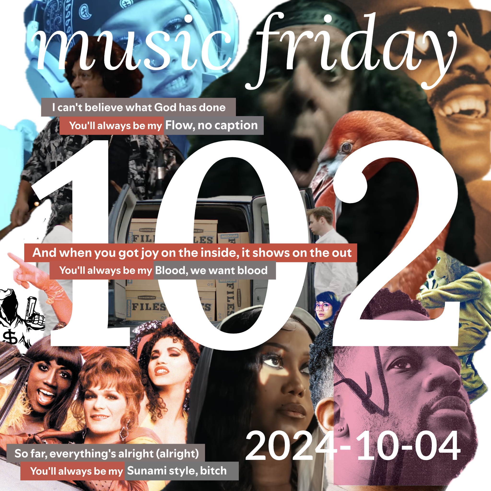

some songs from 11 people
[youtube (11/11)](<https://youtube.com/playlist?list=PLHKkvq2Z_NhiHa-2X1nX4OWkEcpvBHQZY>) — [spotify (11/11)](<https://open.spotify.com/playlist/4waINbWqUgGRaJ8eaWdscE>) — [bandcamp (6/11)](<https://www.buymusic.club/list/mrfb-mf102-2024-10-04>) — [archive](https://github.com/mrfb/music-friday/)

---

tracks on each side are sorted by the order in which they were sent

<b>youtube link legend</b>
<ul><li>📼 video</li><li>💿 audio</li><li>🎟️ live</li><li>👢 unofficial</li><li>🤩 fanworks</li></ul>

### side a: favorite tracks
1. **open mike eagle** - *everything ends last year* ([yt.💿](https://youtu.be/UK-qN8k7xwQ) [sp](https://open.spotify.com/track/0ajnfowkNlVihOU6lv1YTa) [bc](https://openmikeeagle.bandcamp.com/track/everything-ends-last-year)) [RT] @laminatedmoth: *"it's october and i'm tired"*
1. **muni long** - *superpowers* ([yt.💿](https://youtu.be/utFeGJ2KsiA) [sp](https://open.spotify.com/track/7KaM1Tz8Jsv6m2lUsmUy4z) ~~bc~~) [THCR] chris
1. **salt n peppa** - *i am the body beautiful* ([yt.💿](https://youtu.be/qq6NQv8wuyk) [sp](https://open.spotify.com/track/1M4edABBrqbBjTWcF0u9qw) ~~bc~~) [RHG] lee mack: *"we need more movies like to wong foo, thanks for everything, julie newmar"*
1. **the envy corps** - *screen test* ([yt.💿](https://youtu.be/37fr7tnRWz0) [sp](https://open.spotify.com/track/1YEHlTA9ftd0lMSvvZBFgo) ~~bc~~) [🕳️] kirby macintosh
1. **cheekface** - *flies* ([yt.📼](https://youtu.be/RLTmj3yxzKE) [sp](https://open.spotify.com/track/4Opsw8gkQZB7ArERdDUlFJ) [bc](https://cheekface.bandcamp.com/track/flies)) [HAUS] lior
1. **caribou** - *honey* ([yt.📼](https://youtu.be/yC0r8RCYyvY) [sp](https://open.spotify.com/track/6HKJBoeEzRgDXIZ5e8llRa) [bc](https://caribouband.bandcamp.com/track/honey-3)) [LORE] sven_kroosl
1. **makaya mccraven** - *the knew untitled* ([yt.🎟️](https://youtu.be/nfc-o4FBA-A) [sp](https://open.spotify.com/track/3kjH2aqlYR86fcWxLaVuyu) [bc](https://intlanthem.bandcamp.com/track/the-knew-untitled)) [∀] @mrfb: *"🎸🥁🪈"*
1. **coheed and cambria** - *blind side sonny* ([yt.📼](https://youtu.be/bb_hDngr8ao) [sp](https://open.spotify.com/track/3yJIHyPa3J6SadRkhp5QsZ) ~~bc~~) [RHG] evan
1. **stevie wonder** - *isnt she lovely* ([yt.💿](https://youtu.be/oE56g61mW44) [sp](https://open.spotify.com/track/3NlLmKBJozwoi0k03Feb1N) ~~bc~~) [RT] leivathan: *"[a rewrite of this was my last post on cohost](https://cohost.org/leivathan/post/7923874-wait-actually)"*
1. **bizarrap, snow tha product** - *snow tha product: bzrp music sessions, vol. 39* ([yt.📼](https://youtu.be/t490zXLrQDE) [sp](https://open.spotify.com/track/5hpOBmnNc1mahkYGmte4NI) [bc](https://bizarrap.bandcamp.com/track/snow-tha-product-bzrp-music-sessions-vol-39)) [HAUS] jadles: *"subtitles on 🇲🇽"*
1. **sunami** - *weak die first* ([yt.💿](https://youtu.be/iXSk6yRqYxk) [sp](https://open.spotify.com/track/24DiFbDET9cXOV2ETRcaFv) [bc](https://sunami408.bandcamp.com/track/weak-die-first)) [LATT] garrett stubbs: *"this song is dedicated to mr. met and all of the new york mets. they are the weak described in the song and their death will be gory"*

thanks! 💖 mrfb