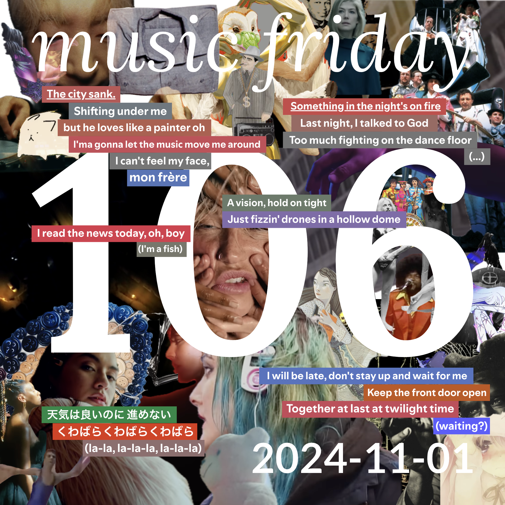

some songs from 29 people
[youtube (30/31)](<https://youtube.com/playlist?list=PLHKkvq2Z_NhiWT2btASMZcioUlwNXzhSy>) — [spotify (29/31)](<https://open.spotify.com/playlist/7IOK5poJNUuGZNObUEPhK4>) — [bandcamp (15/31)](<https://www.buymusic.club/list/mrfb-mf106-2024-11-01>) — [archive](https://github.com/mrfb/music-friday/)

---

### side a: favorite tracks
1. **mt. joy** - *she wants to go dancing* ([yt.📼](https://youtu.be/R7dnn2LP5fs) [sp](https://open.spotify.com/track/3CTBfot80XAOyuaJ1jcN5z) ~~bc~~)
[SLSK] eric
1. **憂鬱 (yu-utsu)** - *そ​れ​は​愛​を​返​さ​あ​り​ま​せ​ん* ([yt.👢](https://youtu.be/B0FjsDF2mI8) ~~sp~~ [bc](https://aloecitywrld.bandcamp.com/track/--3))
[SLSK] jamie
1. **kesha** - *eat the acid* ([yt.📼](https://youtu.be/J1hecebh3Hc) [sp](https://open.spotify.com/track/37Y43R25SpX3Jndaw7qnxu) ~~bc~~)
[RNV] matt schneider: *"i kind of ignored kesha before this because i was a foolish snob and this album—especially this song—completely blew up my ignorant take."*
1. **the specials** - *ghost town* ([yt.📼](https://youtu.be/RZ2oXzrnti4) [sp](https://open.spotify.com/track/6ewN9MaFbi78oDLT9wYDgn) ~~bc~~)
[RT] sgt sphynx
1. **tyler, the creator** - *rah tah tah* ([yt.💿](https://youtu.be/R_clisSImS4) [sp](https://open.spotify.com/track/5RePVWy39tLpHH0WwXgBsK) ~~bc~~)
[RT] wryan
1. **backstreet boys** - *the call* ([yt.📼](https://youtu.be/wMOkm57vu0k) [sp](https://open.spotify.com/track/1mxTCArq9EhSg4QPGqhjhT) ~~bc~~)
[KLDE] jo dee: *"been stuck in my head all week & now it's your problem. spoken skit intro, flamenco guitar, and a fart for the bass beat. iconic."*
1. **kolida babo** - *anthony joseph sciacca* ([yt.💿](https://youtu.be/ZLw7_ihQBxs) [sp](https://open.spotify.com/track/1ATLU1BsRaXxhfxmvOs2Mg) [bc](https://kolidababo.bandcamp.com/track/anthony-joseph-sciacca-2))
[∀] @mrfb: *"what’s that? you think i only like this because it reminds me of friends at the table? that’s ridiculous"*
1. **mili** - *through patches of violet* ([yt.💿](https://youtu.be/G_JfKOjwzwo) [sp](https://open.spotify.com/track/6C3NjslaxrAHpiU9W5XTiV) [bc](https://project-mili.bandcamp.com/track/through-patches-of-violet))
[HCC] fabian
1. **tor, sufjan stevens, aesop rock** - *star of wonder / none shall pass* ([yt.💿](https://youtu.be/MKXp17Udsjk) ~~sp~~ [bc](https://dezordrrecords.bandcamp.com/track/star-of-wonder-none-shall-pass))
[THCR] chris: *"one of my favorite mix cds, thought of it last week & began re-listening. free to download!"*
1. **amyl and the sniffers** - *chewing gum* ([yt.📼](https://youtu.be/DxOMGj8P2hY) [sp](https://open.spotify.com/track/65qpo8Xop4WCkjGX2wjIAy) [bc](https://amylandthesniffers.bandcamp.com/track/chewing-gum))
[KLDE] e / @bennygesserit: *"going to need this surgically removed from my brain soon."*
1. **dominique fils-aimé** - *moi je t'aime* ([yt.📼](https://youtu.be/a0dZvSsvZdA) [sp](https://open.spotify.com/track/56KQ2AgzaOH2QYroQ6d3Rg) [bc](https://singwithmi.bandcamp.com/track/moi-je-taime))
[CHST] shel k: *"wistful jazz ballad with folk melody vocal harmonies"*
1. **mogwai** - *god gets you back* ([yt.📼](https://youtu.be/hq30tXF-n5E) [sp](https://open.spotify.com/track/0pKQEfjPMQqjFzNQRVNjDs) [bc](https://mogwai.bandcamp.com/track/god-gets-you-back-2))
[CHST] brendan: *"preview track from upcoming album "the bad fire""*
1. **billy preston** - *will it go round in circles* ([yt.🎟️](https://youtu.be/QDtYo2IPTsw) [sp](https://open.spotify.com/track/0iifjjuozo6r5fh2GWI6Pq) ~~bc~~)
[RHG] lee mack: *"gay icon"*
1. **joshua burnside** - *and you evade him / born in the blood* ([yt.📼](https://youtu.be/qlsgL9K8ItM) [sp](https://open.spotify.com/track/7I52zUiDzsxN7ZHKEc3Ope) [bc](https://joshuaburnside.bandcamp.com/track/and-you-evade-him-born-in-the-blood-2))
[SFPC] elliott
1. **the beatles** - *a day in the life (2009 remaster)* ([yt.💿](https://youtu.be/UYeV7jLBXvA) [sp](https://open.spotify.com/track/0hKRSZhUGEhKU6aNSPBACZ) ~~bc~~)
[RT] dan 🤠: *"these guys are pretty good, wonder if anyone's heard of them"*
1. **graeme revell** - *inferno* ([yt.💿](https://youtu.be/Q_JC17_kKb4) [sp](https://open.spotify.com/track/3Zy9BLqlbeoDv7xsx0Cvrn) ~~bc~~)
[THCR] blackcoat: *"while the the crow's ost rightfully gets accolades as maybe the best soundtrack ever, the score is an album i still listen to all the time"*
1. **glass animals** - *flip* ([yt.💿](https://youtu.be/NvUDjtVm_wk) [sp](https://open.spotify.com/track/48KSlIKpiGGMiwmnTqumyg) ~~bc~~)
[HAUS] kathryn: *"new headphones make bass go wubbbbbbb"*
1. **tracey brakes** - *back to sleep* ([yt.💿](https://youtu.be/4QPP_e2z4lQ) [sp](https://open.spotify.com/track/0S2j5M3SEtOpLAs3NuEjXE) [bc](https://traceybrakes.bandcamp.com/track/back-to-sleep))
[CHST] cass
1. **creepy nuts** - *オトノケ (otonoke)* ([yt.📼](https://youtu.be/tRwHpyOq4P4) [sp](https://open.spotify.com/track/6KYOlIwDHbrbeBbJEtQ0Fj) ~~bc~~)
[HAUS] speep: *"rent free this one"*
1. **vienna teng** - *we've got you (∞ - two truths)* ([yt.💿](https://youtu.be/Gi8yP5RpSaQ) [sp](https://open.spotify.com/track/2Dx6Wf45vCXjQcuYERb8Ca) [bc](https://viennateng.bandcamp.com/track/weve-got-you-two-truths))
[RHG] caro: *"earlier this summer i thought "were due for another stray italian greyhound moment" and sure enough here we are. there's layers to this one"*
1. **tri yann** - *complainte de la blanche biche (the white doe's lament)* ([yt.💿](https://youtu.be/Jpk_LPhVTpg) [sp](https://open.spotify.com/track/48gEDUZbLnEU5oQcgF8SDa) ~~bc~~)
[RT] emery
1. **great knife** - *a suffering soul* (~~yt~~ [sp](https://open.spotify.com/track/6Eju8gf0nfNJmHt3BGViWh) [bc](https://greatknife.bandcamp.com/track/a-suffering-soul))
[RT] moose
1. **massive attack, young fathers** - *voodoo in my blood* ([yt.📼](https://youtu.be/ElvLZMsYXlo) [sp](https://open.spotify.com/track/3iyJPBtWnucN4b5CoC9Zhv) ~~bc~~)
[HAUS] jadles: *"🧙"*
1. **oh!dulceari** - *ok!* ([yt.📼](https://youtu.be/vIDGawtXd1E) [sp](https://open.spotify.com/track/6sXmUwXtIHkHzd3olAdjhO) ~~bc~~)
[THCR] josué: *"catchy"*
1. **bruno coulais, laurent petitgerard, hungarian symphony orchestra** - *mice circus* ([yt.💿](https://youtu.be/kn443UXO5C4) [sp](https://open.spotify.com/track/6izFCYe2xyvNbhMCutwhmL) ~~bc~~)
[🕳️] kirby macintosh
1. **the platters** - *twilight time* ([yt.💿](https://youtu.be/ucaNUkU0SCk) [sp](https://open.spotify.com/track/3MpGQae6zAFd7Z1FdLV9fV) ~~bc~~)
[RT] eleanor: *"maybe i'm just feeling sappy, but god, what a voice."*
1. **ゆこぴ (yukopi), 歌愛ユキ (kaai yuki)** - *kyoufuu all black* ([yt.📼](https://youtu.be/D6DVTLvOupE) [sp](https://open.spotify.com/track/3rO7YwtuTzCGssxvDS4xK2) ~~bc~~)
[HCC] jacob
1. **jasmine.4.t** - *elephant* ([yt.📼](https://youtu.be/KkT3ODAxmm8) [sp](https://open.spotify.com/track/6eIoIF1c8zjyKg7Yk5n8pA) [bc](https://jasmine4t.bandcamp.com/track/elephant))
[RT] leivathan
1. **bryan john appleby** - *noah’s nameless wife* ([yt.💿](https://youtu.be/1bkRMARx-8k) [sp](https://open.spotify.com/track/1YhHyFvlUph0bTErb16EfE) [bc](https://bryanjohnappleby.bandcamp.com/track/noahs-nameless-wife))
[LORE] extremely big dawg isis: *"shoutout to all the ladies in the bible who simply do not have names because the misogynist writers couldn’t be fucked to come up with them"*

### side b: extra helpings
1. **the crane wives** - *sleeping giants* ([yt.💿](https://youtu.be/Z1Cl0YSV1wI) [sp](https://open.spotify.com/track/2n1aDv1sVmvaA6OVq8KTFe) [bc](https://thecranewives.bandcamp.com/track/sleeping-giants))
[🕳️] kirby macintosh
1. **caroline polachek** - *billions* ([yt.📼](https://youtu.be/4zEQJrggKgk) [sp](https://open.spotify.com/track/4JPF8Te7Jo3AuI2vKqrRUV) [bc](https://carolinepolachek.bandcamp.com/track/billions))
[RT] leivathan

thanks! 💖 mrfb