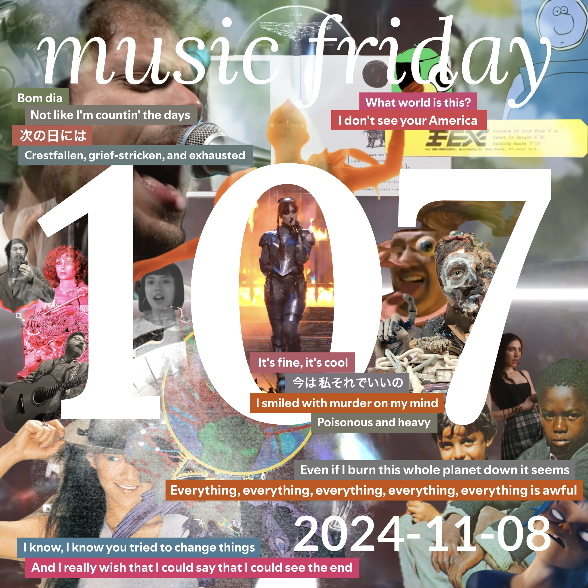

some songs from 21 people
[youtube (22/24)](<https://youtube.com/playlist?list=PLHKkvq2Z_Nhhv0eD2JLzVVvfmEyykrRUW>) — [spotify (20/24)](<https://open.spotify.com/playlist/2NWE2I04sb3MXDZYuiMctu>) — [bandcamp (11/24)](<https://www.buymusic.club/list/mrfb-mf107-2024-11-08>) — [archive](https://github.com/mrfb/music-friday/)

---

### side a: favorite tracks
1. **supplicate** - *the penrose stairs* ([yt.💿](https://youtu.be/XXpgc5q67PM) [sp](https://open.spotify.com/track/5nvHjKLiIIWIeiEsQDFHma) [bc](https://supplicate.bandcamp.com/track/the-penrose-stairs))
[RT] moose
1. **ethel cain** - *punish* ([yt.📼](https://youtu.be/nIvMmTsZVLo) [sp](https://open.spotify.com/track/2Iy2Qj5kTsmXAndBnOWdy4) ~~bc~~)
[SFPC] emily s
1. **gorillaz, thundercat** - *cracker island* ([yt.📼](https://youtu.be/S03T47hapAc) [sp](https://open.spotify.com/track/2W3ZpQg9i6lE6kmHbcdu9N) ~~bc~~)
[CHST] surasshu: *"i always really loved gorillaz first 2 albums but i think i underestimated just how good (and strange!) they are musically"*
1. **anri** - *lady sunshine* ([yt.💿](https://youtu.be/Pme_z3Rn9KA) [sp](https://open.spotify.com/track/1x33hYJerbtoNgUSd5PEzN) ~~bc~~)
[KLDE] facultystaff: *"i’ve been living in the city pop hole this week."*
1. **vylet pony** - *play dead! play dead!* ([yt.💿](https://youtu.be/HbnIDCjR2dM) [sp](https://open.spotify.com/track/1ZBThdEMoyeaZntxKbPsjL) [bc](https://vyletpony.bandcamp.com/track/play-dead-play-dead))
[CHST] heather flowers: *"black dresses style scream rock about your cancelsona getting transformed into a werewolf. completely electric. (cw: f-slur)"*
1. **living color** - *which way to america* ([yt.💿](https://youtu.be/5bflbbOk-FI) [sp](https://open.spotify.com/track/3EEpP7SNSga1tekgS0Xben) ~~bc~~)
[THCR] @vaklam
1. **the decemberists** - *everything is awful* ([yt.💿](https://youtu.be/GCd5OT9oOxA) [sp](https://open.spotify.com/track/3rNYkRnptT2EJViC13Pae9) ~~bc~~)
[🕳️] kirby macintosh: *"it is unfortunately time to relisten to the decemberists' 2018 album i'll be your girl"*
1. **free snacks, audra vidal** - *guud* (~~yt~~ [sp](https://open.spotify.com/track/5DxHoxg1rH2MScK3JF9js2) [bc](https://freesnacks.bandcamp.com/track/guud-feat-audra-vidal))
[CHST] mike h
1. **lô borges** - *um girassol da cor do seu cabelo (a sunflower the color of your hair)* ([yt.💿](https://youtu.be/l8ETbYy83Vc) [sp](https://open.spotify.com/track/2eDUcjS6SSDJd6Rcx4TFkd) ~~bc~~)
[RT] may: *"this is a classic of brazilian popular music; but before i had only ever heard covers, and not the original recording. turns out it's great!"*
1. **xg** - *howling* ([yt.📼](https://youtu.be/rGqEuk8Om-4) [sp](https://open.spotify.com/track/2uaZaTMbYE5KAk8gbdzBgW) ~~bc~~)
[RT] valos: *"fantastic rap verses with a smooth & vibey chorus"*
1. **metric** - *dead disco* ([yt.📼](https://youtu.be/cEsr5Mm3JfE) [sp](https://open.spotify.com/track/0vJPVfyCJ0WwrBQ71FP23s) [bc](https://oldworldunderground.bandcamp.com/track/dead-disco))
[RT] sgt sphynx
1. **jeff rosenstock** - *i wanna be wrong* ([yt.💿](https://youtu.be/073nQbcIO34) [sp](https://open.spotify.com/track/7zZlKdoqFGs28YRPL1EeqF) [bc](https://jeffrosenstock.bandcamp.com/track/i-wanna-be-wrong))
[RT] natalina june
1. **ceschi** - *say something* ([yt.💿](https://youtu.be/_K_tPDxbXAY) [sp](https://open.spotify.com/track/420mRwidVuitYtOoNkg3xL) [bc](https://ceschi.bandcamp.com/track/say-something))
[HAUS] olifer
1. **pet shop boys** - *yesterday, when i was mad* ([yt.📼](https://youtu.be/jS0fsoyrFg4) [sp](https://open.spotify.com/track/2aDbF0cdHPWq7Mj5AIsl1h) ~~bc~~)
[HAUS] jadles: *"i thought again… and changed my mind 🫠"*
1. **the noble demon** - *the grand finale* ([yt.💿](https://youtu.be/pQnv5hXdY08) ~~sp~~ ~~bc~~)
[HCC] anthony sanchez: *"rearrangement by evelyn lark/the noble demon"*
1. **godspeed you! black emperor** - *grey rubble - green shoots* ([yt.👢](https://youtu.be/sYv8dmzYhAw) [sp](https://open.spotify.com/track/64CZWPzX5OMmZoQCmaXSyF) [bc](https://godspeedyoublackemperor.bandcamp.com/track/grey-rubble-green-shoots/))
[CHST] toad: *"from the river to the sea, palestine will be free"*
1. **jeff rosenstock** - *usa* ([yt.🎟️](https://youtu.be/0YJOSptWmsQ) [sp](https://open.spotify.com/track/6AvAx1yKwB3xgBTSYty8rg) [bc](https://jeffrosenstock.bandcamp.com/track/usa))
[HAUS] lior
1. **カネコアヤノ (kaneko ayano)** - *ロマンス宣言 (romance sengen)* ([yt.📼](https://youtu.be/w3RDwQjUekU) [sp](https://open.spotify.com/track/7ph7HRUsxYcKLRFTaYCQYQ) ~~bc~~)
[HCC] jacob
1. **caroline polachek** - *so hot you're hurting my feelings* ([yt.📼](https://youtu.be/sn3cHUtNZKo) [sp](https://open.spotify.com/track/5B6Kjha6RRIMWGN7zGsAaT) [bc](https://carolinepolachek.bandcamp.com/track/so-hot-youre-hurting-my-feelings))
[RT] leivathan: *"i was gonna put in leonard cohens democracy, but... y'know"*
1. **the fiery furnaces** - *my dog was lost but now he's found* (~~yt~~ ~~sp~~ [bc](https://thefieryfurnaces.bandcamp.com/track/my-dog-was-lost-but-now-hes-found-3))
[∀] @mrfb: *"this is the version off of their recently released live album "stuck in my head", full of some really electric synth and drumming."*

### side b: extra helpings
1. **factor chandelier, ceschi** - *sky high* ([yt.📼](https://youtu.be/DaiMPZpSSUE) [sp](https://open.spotify.com/track/0vQY9bs3q5E7ImUBsJnc2G) [bc](https://fakefour.bandcamp.com/track/sky-high-prod-by-factor-chandelier))
[CHST] stevejmar: *"this isn't my favorite track from ceschi's latest (last?) album but excellent production, strong flow, hits all of ceschi's major themes."*
1. **aaron long** - *tito's beat* ([yt.👢](https://youtu.be/v9PMIU8UQP0) ~~sp~~ ~~bc~~)
[🕳️] kirby macintosh
1. **fex** - *subways of your mind* ([yt.👢](https://youtu.be/NbKTOuLCg-o) ~~sp~~ ~~bc~~)
[🕳️] kirby macintosh: *"in case you haven't heard the good news: they found the most mysterious song on the internet"*
1. **chappell roan** - *good luck babe!* ([yt.🎟️](https://youtu.be/6ENzV125lWc) [sp](https://open.spotify.com/track/0WbMK4wrZ1wFSty9F7FCgu) ~~bc~~)
[RT] leivathan: *"good song is good!"*

thanks! 💖 mrfb