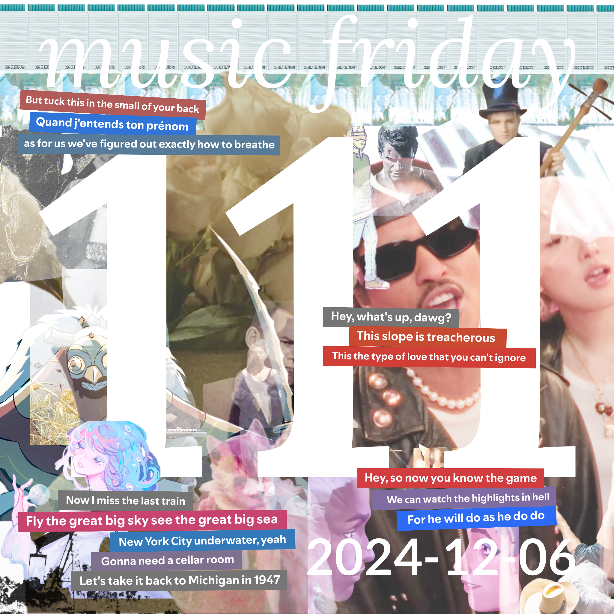

songs from 21 people
[youtube (22/22)](<https://youtube.com/playlist?list=PLHKkvq2Z_NhijoAm2Dm2RgqfJQQ34w3wy>) — [spotify (21/22)](<https://open.spotify.com/playlist/5FSfTJMswsCz8mxL56alDi>) — [bandcamp (12/22)](<https://www.buymusic.club/list/mrfb-2024-12-06-mf111>) — [archive](https://github.com/mrfb/music-friday/)

---

### side a: favorite tracks
1. **taylor swift** - *treacherous* ([yt.💿](https://youtu.be/u1D1AgDfreg) [sp](https://open.spotify.com/track/3S7HNKPakdwNEBFIVTL6dZ) ~~bc~~)
[RNV] matt s: *"god i love the drama of this song"*
1. **d4vd** - *feel it* ([yt.💿](https://youtu.be/vZi8ET9k11g) [sp](https://open.spotify.com/track/3SAga35lAPYdjj3qyfEsCF) ~~bc~~)
[HCC] john melendez
1. **henry jackman** - *race to libertalia* ([yt.💿](https://youtu.be/qqrhlx2jTFE) [sp](https://open.spotify.com/track/0aO4RAJHdQwcNgKIqiSGta) ~~bc~~)
[RHG] evan
1. **the coup** - *5 million ways to kill a c.e.o.* ([yt.🤩](https://youtu.be/RQthFDpYCys) [sp](https://open.spotify.com/track/2zO4tORsvzObeP7B8A8bIB) ~~bc~~)
[KLDE] e / bennygesserit: *"obvious choice but maybe the addition will help introduce the coup to a new generation"*
1. **shallowater** - *angels* ([yt.💿](https://youtu.be/HOGhZuub87w) [sp](https://open.spotify.com/track/5LdWGC38ftcj2gRzU1M6rD) [bc](https://shallowater.bandcamp.com/track/angels))
[KLDE] facultystaff: *"a stone cold “latt told me to listen to this” classic"*
1. **9mm parabellum bullet** - *fuel on the fire!!* ([yt.💿](https://youtu.be/fPLZ01-DbzE) [sp](https://open.spotify.com/track/3MMOEzQl39GRPiaYrArIg5) ~~bc~~)
[∀] @mrfb: *"i am not immune to wow cool guitars"*
1. **knower** - *same smile different face (real version)* ([yt.📼](https://youtu.be/o14kI3j8gh8) ~~sp~~ [bc](https://knowermusic.bandcamp.com/track/same-smile-different-face-real-version))
[CHST] heather flowers: *"knower bounces back and forth between shitpost jazz funk and heavenly ethereal melancholy; this track is the latter."*
1. **jason derulo** - *rum tum tugger* ([yt.📼](https://youtu.be/ELTp0VWjnnI) [sp](https://open.spotify.com/track/6d3FeDqpMHwtCG2PL7ftIB) ~~bc~~)
[RHG] lee mack: *"14 days until the 5 year anniversary of cats (2019)"*
1. **coil** - *red birds will fly out of the east and destroy paris in a night* ([yt.💿](https://youtu.be/AIah4xVmqfU) [sp](https://open.spotify.com/track/1DPK4pNgtejbbNgqy9wmKx) [bc](https://coilofficial.bandcamp.com/track/red-birds-will-fly-out-of-the-east-and-destroy-paris-in-a-night))
[RT] moose
1. **destructo disk** - *y'all act like i won't die by the blade* ([yt.💿](https://youtu.be/NKzjWCMuF38) [sp](https://open.spotify.com/track/0LpdpDte4sNJoHKNr0caPX) [bc](https://sockhead.bandcamp.com/track/yall-act-like-i-wont-die-by-the-blade))
[LORE] sven_kroosl
1. **pup** - *see you at your funeral* ([yt.💿](https://youtu.be/yIgu46uI9XU) [sp](https://open.spotify.com/track/511ZEJJELVd9gYpS9u63us) [bc](https://puptheband.bandcamp.com/track/see-you-at-your-funeral))
[RT] dolost: *"not huge on pop punk usually but love this band."*
1. **bloodywood, babymetal** - *bekhauf* ([yt.📼](https://youtu.be/skXlKxjlUoo) [sp](https://open.spotify.com/track/0KLm7cjKriGkqI0ApLlzNb) [bc](https://bloodywood.bandcamp.com/track/bekhauf-feat-babymetal))
[RT] valos
1. **city girl, in love with a ghost** - *healing sorrow* ([yt.💿](https://youtu.be/HNZWwIHhu7c) [sp](https://open.spotify.com/track/1Wy7dbkrzyf01anJE43UNR) [bc](https://city-girl.bandcamp.com/track/healing-sorrow-feat-in-love-with-a-ghost))
[RHG] caro: *"a new city girl album drop is always cause to celebrate"*
1. **negative supply** - *june ny* ([yt.💿](https://youtu.be/FBxUEvTssP4) [sp](https://open.spotify.com/track/0l2rgEOhaNiklnTrnahdfU) [bc](https://kshack.bandcamp.com/track/june-ny))
[RNV] dubbin: *"my friends recorded this during a live set in my backyard two years ago!!"*
1. **stromae, pomme** - *ma meilleure ennemie* ([yt.💿](https://youtu.be/1F3OGIFnW1k) [sp](https://open.spotify.com/track/4lriIG2vNqwDWzOj2I9rtj) [bc](https://riotgames.bandcamp.com/track/ma-meilleure-ennemie))
[THCR] noctivagant: *"arcane heartbreaker"*
1. **kendrick lamar** - *tv off* ([yt.💿](https://youtu.be/U8F5G5wR1mk) [sp](https://open.spotify.com/track/0aB0v4027ukVziUGwVGYpG) ~~bc~~)
[RT] leivathan: *"hey kendrick, what do you want on your hot dog?"*
1. **the world is a beautiful place & i am no longer afraid to die** - *walnut street is dead (long live walnut street)(2010)* ([yt.💿](https://youtu.be/k8vXdIoUrXg) [sp](https://open.spotify.com/track/6tNFC85BRjENaWFe7eLix2) [bc](https://theworldis.bandcamp.com/track/walnut-street-is-dead-long-live-walnut-street-2))
[SLSK] faye: *"im back in 2013, theres an afternoon thunderstorm, the air is warm and fragrant and vibrant... wish i made it to miami then to see them live"*
1. **darkside** - *gone too soon* ([yt.💿](https://youtu.be/SufCYQRXjxs) [sp](https://open.spotify.com/track/1pbM1RxC8vRhgon7PszVds) [bc](https://otherpeople.bandcamp.com/track/gone-too-soon-darkside))
[HAUS] jadles: *"🌌"*
1. **the b-52's** - *roam* ([yt.📼](https://youtu.be/iNwC0sp-uA4) [sp](https://open.spotify.com/track/5fqcIHU6DhQtFKVO5XSdQs) ~~bc~~)
[RT] xenon: *"i get drunk and sing it to my cat 🐱🎶"*
1. **rosé, bruno mars** - *apt.* ([yt.📼](https://youtu.be/ekr2nIex040) [sp](https://open.spotify.com/track/2ipHkoYux6uY1DwwBb4aFV) ~~bc~~)
[LORE] stantium
1. **geese** - *cowboy nudes* ([yt.💿](https://youtu.be/XP7zwv5FrX4) [sp](https://open.spotify.com/track/7i8XQTUczz7xyFdkSAdEg9) [bc](https://geesebandnyc.bandcamp.com/track/cowboy-nudes-2))
[RT] overheater

### side b: extra helpings
1. **kendrick lamar** - *reincarnated* ([yt.💿](https://youtu.be/Ek7UvQPCQnE) [sp](https://open.spotify.com/track/0RgjEkSbeuStKfT2Pa4Zai) ~~bc~~)
[RT] leivathan: *"forgot to put these up last week. probs my favorite track on the album"*

thanks! 💖 mrfb