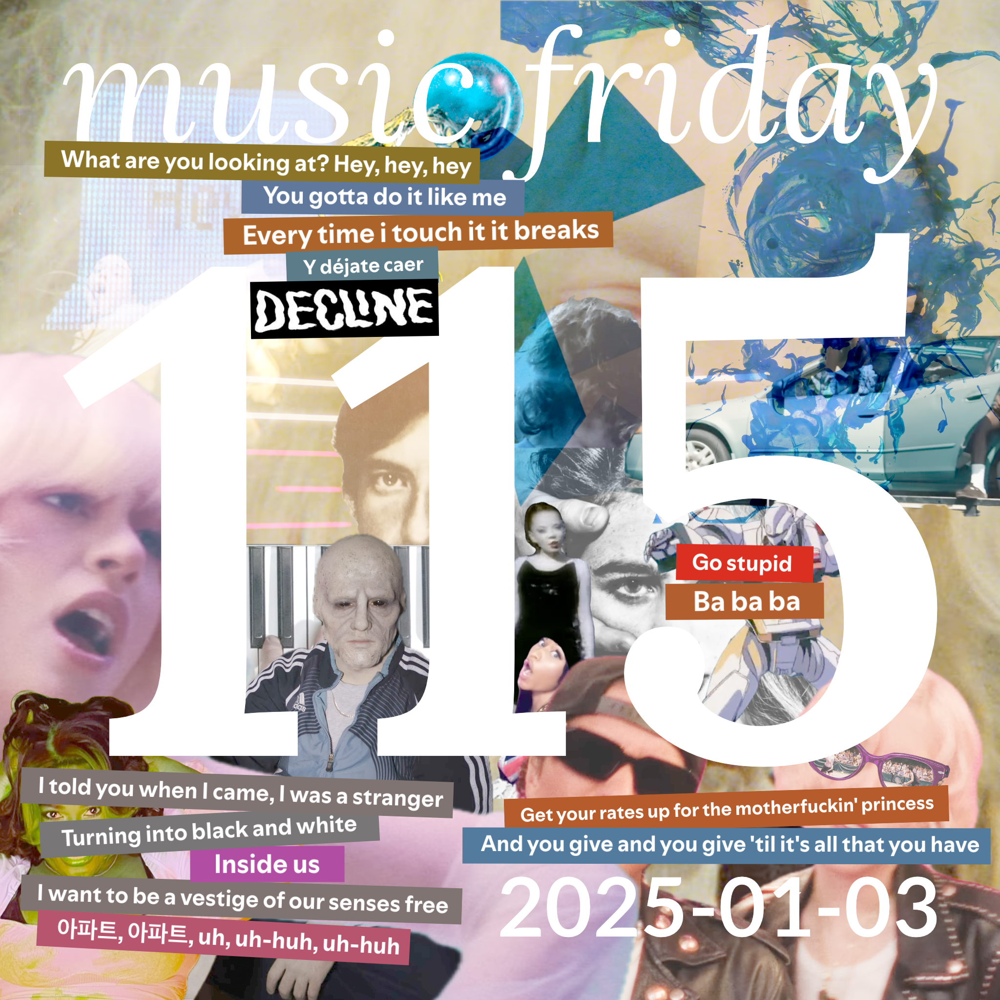

songs from 19 people
[youtube (21/21)](<https://youtube.com/playlist?list=PLHKkvq2Z_Nhhj2HCF3zbEJloMvGSIuEn1>) — [spotify (18/21)](<https://open.spotify.com/playlist/0JWC3GB4VY9dLEWYAoocUr>) — [bandcamp (11/21)](<https://www.buymusic.club/list/mrfb-2025-01-03-mf115>) — [archive](https://github.com/mrfb/music-friday/)

---

### side a: favorite tracks
1. **rudresh mahanthappa, adam o'farrill, matt mitchell, françois moutin, rudy royston** - *chillin'* ([yt.💿](https://youtu.be/iaTJRr3ZkkU) [sp](https://open.spotify.com/track/24ixwdTPYk2n4GieIJgtZX) [bc](https://rudreshmahanthappa2.bandcamp.com/track/chillin))
[∀] @mrfb: *"nyc winter jazzfest approaches"*
1. **jessica pratt** - *world on a string* ([yt.📼](https://youtu.be/MnXYxe1PaMo) [sp](https://open.spotify.com/track/06uOV6fQr0khY0LzYcy4w0) [bc](https://jessicapratt.bandcamp.com/track/world-on-a-string))
[RT] larks
1. **doechii** - *nissan altima* ([yt.📼](https://youtu.be/iGbeZNqklic) [sp](https://open.spotify.com/track/2dKkVF2m160z0RNDN2dddc) ~~bc~~)
[KLDE] e / bennygesserit
1. **magdalena bay** - *death & romance* ([yt.📼](https://youtu.be/_8gfVTnbBi8) [sp](https://open.spotify.com/track/5m3rVRNkTv5EQnPuF293we) [bc](https://magdalenabay.bandcamp.com/track/death-romance-1))
[LATT] definitely not an ai generated profile that matthew created to make his music friday endeavor look more appealing to private equity investors, therefore allowing him to sell out and profit: *"on the list of "songs that i can convince myself i would do a decent job of at karaoke despite that probably not being the case""*
1. **trent reznor and atticus ross** - *compress / repress* ([yt.💿](https://youtu.be/mJAQaNb39hI) [sp](https://open.spotify.com/track/40k8Fcfap0ZOiMClwz9VlP) ~~bc~~)
[CHST] brendan
1. **heaven in her arms** - *entangled torus* ([yt.👢](https://youtu.be/i3g8JPg3Zgs) ~~sp~~ [bc](https://heaveninherarms.bandcamp.com/track/entangled-torus))
[RT] moose
1. **rosé** - *apt.* ([yt.📼](https://youtu.be/ekr2nIex040) [sp](https://open.spotify.com/track/5vNRhkKd0yEAg8suGBpjeY) [bc](https://suniverseq.bandcamp.com/track/apt))
[THCR] andy hauge : *"late to the party, but this finally got stuck in my head!"*
1. **los jaivas** - *en el tren a paisandú* ([yt.💿](https://youtu.be/HK98tIFwl68) [sp](https://open.spotify.com/track/62Ul4vrKeJB2aDhJ6WSZU8) ~~bc~~)
[RT] sergio
1. **m.o.o.n.** - *hydrogen* ([yt.💿](https://youtu.be/SNE2oCZH_4k) [sp](https://open.spotify.com/track/10VVCjsMTbM39bPzygGSex) [bc](https://music.musicofthemoon.com/track/hydrogen))
[RT] sgt sphynx: *"still a banger all these years later"*
1. **tokyo police club** - *bambi* ([yt.📼](https://youtu.be/VyCjFekH05A) [sp](https://open.spotify.com/track/0UM1p4kAZZUN1cNUYs8vUr) [bc](https://tokyo-police-club.bandcamp.com/track/bambi))
[CHST] kirby macintosh
1. **big sean, nicki minaj** - *dance (a$$) remix* ([yt.📼](https://youtu.be/pn1VGytzXus) [sp](https://open.spotify.com/track/3ZAMtgYJFoHwJjFkhkXqKr) ~~bc~~)
[RHG] lee mack: *"we went crazy for this in 2011"*
1. **bricknasty** - *vinland* ([yt.💿](https://youtu.be/3a_olfzak_U) [sp](https://open.spotify.com/track/4rxGfHqxkjke3BbD6a0wkK) ~~bc~~)
[RT] overheater
1. **garbage** - *when i grow up* ([yt.📼](https://youtu.be/Je-CPZRwbh8) [sp](https://open.spotify.com/track/4FBpkhn8xfmdtZebrcNRmu) ~~bc~~)
[RT] valos
1. **anti-spectacular** - *skeleton* ([yt.💿](https://youtu.be/ZIoHq5nVEw8) ~~sp~~ [bc](https://anti-spectacular.bandcamp.com/track/skeleton))
[RT] rommy!: *"if you're familiar with the haus of decline comics this is the same woman's first album!"*
1. **underscores** - *cops and robbers* ([yt.📼](https://youtu.be/u6BajlmkcQc) [sp](https://open.spotify.com/track/08AznbP5RLxjaFOZTqOI9w) [bc](https://underscores.bandcamp.com/track/cops-and-robbers))
[HAUS] jadles: *"🌄🎡🌴🏳️‍⚧️✨"*
1. **e.d. kadence** - *trip on the party bus (drunk demo)* ([yt.💿](https://youtu.be/qCYfR43uYdk) [sp](https://open.spotify.com/track/7at6D38ny5dh9uoybIoLXd) ~~bc~~)
[RT] andy: *"she says "don't ask me what the 'lyrics' are baby i was stimming" and she's right to say it"*
1. **leonard cohen** - *the stranger song* ([yt.💿](https://youtu.be/ZqlR5D0y23s) [sp](https://open.spotify.com/track/5BeT7nwfURe9hldXRhBMKM) ~~bc~~)
[RT] xenon
1. **philip glass, maki namekawa** - *etude no. 1* ([yt.📼](https://youtu.be/2esw5X4oLo0) [sp](https://open.spotify.com/track/6gDeKusyjIReqhTN3SlPm8) [bc](https://philipglass.bandcamp.com/track/etude-no-1-2))
[RT] leivathan: *"this is really fun to play. this version (and every version i've seen) are too fast"*
1. **communión** - *soltando fantasmas* ([yt.📼](https://youtu.be/GsuMe2p1350) [sp](https://open.spotify.com/track/7bHJgY6FJUlFEi9jv9WDDP) ~~bc~~)
[CHST] goatsnail

### side b: extra helpings
1. **st. vincent** - *broken man* ([yt.📼](https://youtu.be/RYJxPg6quL4) [sp](https://open.spotify.com/track/1kgLXgHrXecZyRCDROfAPb) [bc](https://stvincent.bandcamp.com/track/broken-man))
[KLDE] e / bennygesserit
1. **笠原 弘子 (kasahara hiroko)** - *未来派 lovers (futuristic lovers)* ([yt.📼](https://youtu.be/fMpI_bc3LrI) ~~sp~~ ~~bc~~)
[LATT] definitely not an ai generated profile that matthew created to make his music friday endeavor look more appealing to private equity investors, therefore allowing him to sell out and profit: *"love you alphonse"*

thanks! 💖 mrfb