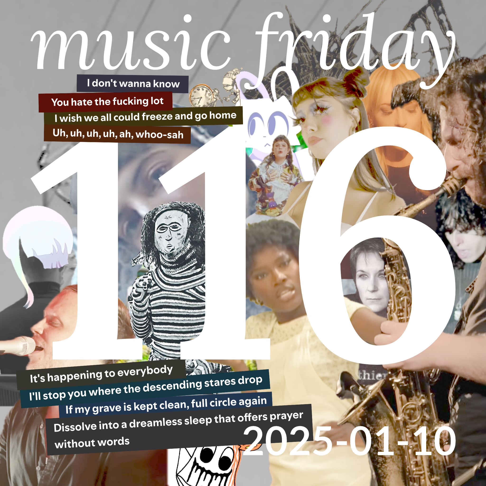

songs from 19 people
[youtube (19/20)](<https://youtube.com/playlist?list=PLHKkvq2Z_NhhHvj7mMCYiVUXx41_dDpAH>) — [spotify (20/20)](<https://open.spotify.com/playlist/0JWC3GB4VY9dLEWYAoocUr>) — [bandcamp (10/20)](<https://www.buymusic.club/list/mrfb-2025-01-10-mf116>) — [archive](https://github.com/mrfb/music-friday/)

---

### side a: favorite tracks
1. **jane remover** - *jrjrjr* ([yt.📼](https://youtu.be/RiwEzF3DsGk) [sp](https://open.spotify.com/track/1mW9XrT9XdnsDPuthSgusZ) ~~bc~~)
[SLSK] dauwpunt: *"such an abrasive, braggadocious lead single. has a cool music video as well that jane edited herself. so excited about this upcoming album!"*
1. **metric** - *days of oblivion* ([yt.📼](https://youtu.be/2I1piA_AQZM) [sp](https://open.spotify.com/track/2p83KMWc8xidIJ0RwXsz25) ~~bc~~)
[RT] sgt sphynx
1. **rosa walton, hallie coggins** - *i really want to stay at your house* ([yt.📼](https://youtu.be/KvMY1uzSC1E) [sp](https://open.spotify.com/track/7mykoq6R3BArsSpNDjFQTm) [bc](https://cyberpunk2077.bandcamp.com/track/i-really-want-to-stay-at-your-house))
[LORE] chris: *"no, you cried at the anime where they say stupid shit like "choom" all the time!"*
1. **moor mother, billy woods, franklin james fisher** - *gang for a day* ([yt.💿](https://youtu.be/wrffuicOUb4) [sp](https://open.spotify.com/track/0YMC166LCqfFJa21mu03Ex) [bc](https://moormother.bandcamp.com/track/gang-for-a-day-feat-franklin-james-fisher))
[RT] moose
1. **ethel cain** - *perverts* ([yt.📼](https://youtu.be/jOeJ9CTEZ-A) [sp](https://open.spotify.com/track/15mQvNeL3jFWwaklufPVWP) ~~bc~~)
[KLDE] abi: *"i didn't listen to preachers daughter as much as some but this definitely did it for me"*
1. **hooky** - *enter capman* ([yt.💿](https://youtu.be/I7cy6o9AEmw) [sp](https://open.spotify.com/track/5bL42V8Wxj5J0kCuld9ng9) [bc](https://hoooky.bandcamp.com/track/enter-capman))
[KLDE] samb_rules: *"some really cool noises"*
1. **pony** - *haunted house* ([yt.📼](https://youtu.be/K0LGo1fZduI) [sp](https://open.spotify.com/track/5qGzJOi8V5CCe0lsEqqOfk) [bc](https://ponyband.bandcamp.com/track/haunted-house))
[RT] anhinton: *"her boyfriend is dead!"*
1. **jan blomqvist, rodrigues jr** - *destination lost* ([yt.📼](https://youtu.be/JrGgFcI-wC0) [sp](https://open.spotify.com/track/1AgIKux324bcXyoSHEdnac) [bc](https://janblomqvist.bandcamp.com/track/destination-lost))
[CHST] brendan
1. **mary gauthier** - *prayer without words* ([yt.💿](https://youtu.be/q6ie8j_mKH4) [sp](https://open.spotify.com/track/6fP9CQNAbcBPoAGurRdHCk) [bc](https://marygauthier.bandcamp.com/track/prayers-without-words))
[RT] xenon: *"you have to listen to country music made by gay women. you have to"*
1. **max richter, louisa fuller, natalia bonner, john metcalfe, ian burdge, chris worsey** - *mrs. dalloway: in the garden* ([yt.📼](https://youtu.be/r_9WNifGn4g) [sp](https://open.spotify.com/track/1x9mP6x7YvKeduQmP3v045) ~~bc~~)
[CHST] kirby macintosh: *"on the "hunting for d&d music" grind"*
1. **deerhoof** - *rainbow silhouette of the milky rain* ([yt.💿](https://youtu.be/pFmKDhJN78c) [sp](https://open.spotify.com/track/2311AH7w8zlMLRXMsEu7xn) [bc](https://deerhoof.bandcamp.com/track/rainbow-silhouette-of-the-milky-rain))
[CHST] qqddllbbpp
1. **the gobs** - *2083 ad* (~~yt~~ [sp](https://open.spotify.com/track/0ITD4OQvgau8oePvmTngTZ) [bc](https://thegobs.bandcamp.com/track/2083-ad))
[RT] overheater
1. **cassettes won't listen** - *freeze and explode* ([yt.💿](https://youtu.be/33HFCsVM5Og) [sp](https://open.spotify.com/track/1MrP14xwOQqvkKhIEgOMEJ) ~~bc~~)
[RT] valos: *"some old-school indie pop. good vibes for driving through the west texas desert at sunrise, thinkin' about life."*
1. **two dollar pistols** - *in my mind* ([yt.💿](https://youtu.be/ytH2ctqpT8U) [sp](https://open.spotify.com/track/2m0stJVRtixTilPgFtjJm6) [bc](https://twodollarpistols.bandcamp.com/track/in-my-mind))
[RT] wryan
1. **doechii** - *denial is a river* ([yt.📼](https://youtu.be/F0cdbR5ognY) [sp](https://open.spotify.com/track/1eTaznNW4Xxtx9za2SMTXB) ~~bc~~)
[RT] dolost
1. **judith** - *heather* ([yt.📼](https://youtu.be/Xd-maigTKWs) [sp](https://open.spotify.com/track/4sVRI3PHCcpYwrboeFSvs2) ~~bc~~)
[RT] rommy!
1. **zohar & adam, ben mizrach, nate allen** - *the crooked* ([yt.🎟️](https://youtu.be/IH0VkodsEX8) [sp](https://open.spotify.com/track/0zoMco6JsNAH4Ss7V9ZuvT) ~~bc~~)
[∀] @mrfb: *"one of my nycwjf highlights was seeing this crew live at the mercury lounge—super joyful performance from them"*
1. **artifyber** - *rain* ([yt.📼](https://youtu.be/Gf02GVdI7D0) [sp](https://open.spotify.com/track/3lFAgJPp9c8aSEqHvDdtwF) ~~bc~~)
[SLSK] lumyr: *"i love this song because it sounds so sweet and warm, like being comfy in bed in a slightly cold day where nothing could go wrong"*
1. **miss bashful, dbbd** - *muschi muschi* ([yt.📼](https://youtu.be/QXyu_L_DAns) [sp](https://open.spotify.com/track/3pqvIzV7DIS9orbtKlHAal) [bc](https://dbbd.bandcamp.com/track/muschi-muschi))
[LATT] a stranger in the downstairs seating area of grand central terminal, who spotted a [turquoised hatted vision](https://i.ibb.co/zfdx2dm/img-0977.jpg) at the donut store and psychically heard the plea for additional music friday songs: *"go birds. the packers are gonna eat that shit and we’re going to the fucking playoffs baby"*

### side b: extra helpings
1. **lola young** - *messy* ([yt.📼](https://youtu.be/k-k2_Liofy8) [sp](https://open.spotify.com/track/3SKH53SPQbEnZR4cJPVaz2) ~~bc~~)
[RT] sgt sphynx

thanks! 💖 mrfb