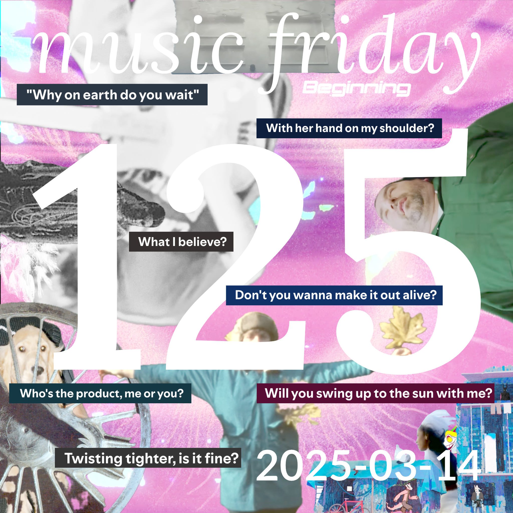

songs from 12 people
[youtube (16/16)](<https://youtube.com/playlist?list=PLHKkvq2Z_NhhSZr7T4QTgtOOFGcE_b0Eo>) — [spotify (14/16)](<https://open.spotify.com/playlist/4MV7n5chALPCdRMJikJmWO>) — [bandcamp (7/16)](<https://www.buymusic.club/list/mrfb-2025-03-14-mf125>) — [archive](https://github.com/mrfb/music-friday/)

---

### side a: favorite tracks
1. **spiritbox** - *soft spine* ([yt.📼](https://youtu.be/80VTmBAnTSE) [sp](https://open.spotify.com/track/3t5GlWUzGSt2lPuiSEPBFG) [bc](https://spiritboxofficial.bandcamp.com/track/soft-spine-2))
[CHST] surasshu: *"the new spiritbox album is great! this was an earlier released single but the album tracks rule also"*
1. **xtc** - *seagulls screaming kiss her, kiss her* ([yt.💿](https://youtu.be/Dw520adnPUg) [sp](https://open.spotify.com/track/6Wj0ipXF6PC04umu0jYplM) ~~bc~~)
[CHST] kirby macintosh: *"save me xtc. xtc save me"*
1. **acloudyskye** - *shoots* ([yt.💿](https://youtu.be/w1ywqbLbuKs) [sp](https://open.spotify.com/track/1vCfhPrzOU3YlO3Mt1xKK8) [bc](https://acloudyskye.bandcamp.com/track/shoots))
[RT] naomi
1. **metric** - *suckers* ([yt.💿](https://youtu.be/4VyaBOJoEe4) [sp](https://open.spotify.com/track/7FA4xByztAlNvzZnFKX4si) ~~bc~~)
[RT] sgt sphynx
1. **kuna maze** - *scraps & pieces* ([yt.💿](https://youtu.be/VJEx3XsVyXY) [sp](https://open.spotify.com/track/6bdxJcQNXOKJeKIwcmAjL9) [bc](https://kunamaze.bandcamp.com/track/scraps-pieces))
[∀] @mrfb: *"a favorite off what was easily the best belgian electro-funk-jazz album i listened to this week"*
1. **lake** - *wonderful sunlight* ([yt.📼](https://youtu.be/mvUOFhTZthg) [sp](https://open.spotify.com/track/1SXWpFcoaAOlTrLZSn7bA3) [bc](https://laketheband.com/track/wonderful-sunlight))
[RT] natalinajune
1. **cheekface** - *living lo-fi* ([yt.📼](https://youtu.be/xfrZOLYyK44) [sp](https://open.spotify.com/track/3YCLqUEnvuOcIv3pRx0AXY) [bc](https://cheekface.bandcamp.com/track/living-lo-fi))
[RT] qqddllbbpp
1. **trustt** - *say-it* ([yt.💿](https://youtu.be/h1YrqpuVSrg) [sp](https://open.spotify.com/track/0LR2wfh87kCJtYCKW5HzGk) ~~bc~~)
[CHST] cass: *"super super creative fusion of digicore and dubstep, every trustt track is a banger"*
1. **the winterer** - *falling petals* ([yt.📼](https://youtu.be/zm20vhsZbsc) ~~sp~~ ~~bc~~)
[HCC] anthony sanchez
1. **laura agnusdei** - *the drowned world* ([yt.💿](https://youtu.be/2W9G5xwDOsU) [sp](https://open.spotify.com/track/41qt5n15KmL5boXhRRE3sk) [bc](https://mapledeathrecords.bandcamp.com/track/the-drowned-world))
[RT] moose
1. **照井 順政 (yoshimasa terui), 蓮尾 理之(masayuki hasuo)** - *the girl on a space colony* ([yt.💿](https://youtu.be/zA7Mtlrlv1I) [sp](https://open.spotify.com/track/3qcgq1KEFhvVKYvQzAUDFq) ~~bc~~)
[CHST] brendan
1. **billie eilish** - *l’amour de ma vie* ([yt.💿](https://youtu.be/am5FI9DkO80) [sp](https://open.spotify.com/track/6fPan2saHdFaIHuTSatORv) ~~bc~~)
[HCC] alex rodriguez

### side b: extra helpings
1. **sade** - *no ordinary love* ([yt.📼](https://youtu.be/_WcWHZc8s2I) [sp](https://open.spotify.com/track/1oaaSrDJimABpOdCEbw2DJ) ~~bc~~)
[RT] naomi
1. **vulfpeck** - *new beastly* ([yt.🎟️](https://youtu.be/hvYnw9Fse2U) [sp](https://open.spotify.com/track/1yQNHzLx4VFofmUNHT3FHa) [bc](https://vulfpeck.bandcamp.com/track/new-beastly))
[∀] @mrfb: *"the rest of this album is way different but really worth checking out"*
1. **cannons** - *purple sun* ([yt.💿](https://youtu.be/E7se0kr6w54) [sp](https://open.spotify.com/track/3Av5sPAsNXVW2tmbz0LA6j) ~~bc~~)
[RT] sgt sphynx
1. **the winterer** - *nobody watching* ([yt.📼](https://youtu.be/mRRR2bWa6FY) ~~sp~~ ~~bc~~)
[HCC] anthony sanchez

thanks! 💖 mrfb