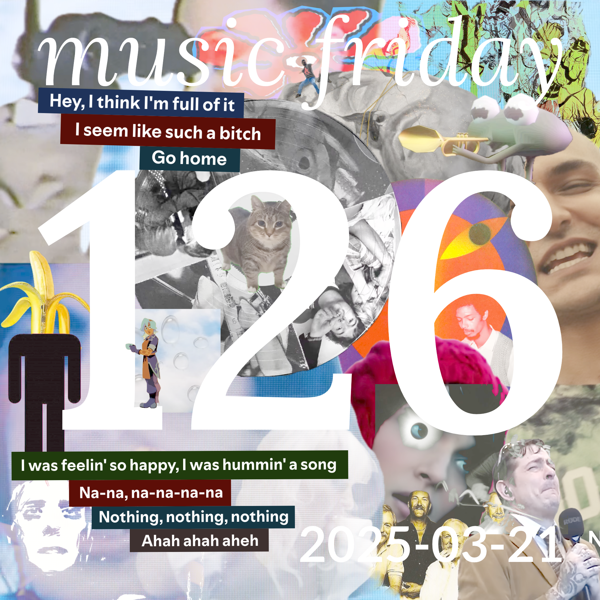

songs from 18 people
[youtube (21/22)](<https://youtube.com/playlist?list=PLHKkvq2Z_NhhjTF9nRN3StKK6bbflShT_>) — [spotify (21/22)](<https://open.spotify.com/playlist/3gS2Q5swefUCEVqKfX9Om4>) — [bandcamp (12/22)](<https://www.buymusic.club/list/mrfb-2025-03-21-mf126>) — [archive](https://github.com/mrfb/music-friday/)

---

### side a: favorite tracks
1. **after** - *300 dreams* ([yt.💿](https://youtu.be/AoJ4ogiZ314) [sp](https://open.spotify.com/track/3gkVuPHTyp4rHH5YrczzOL) [bc](https://after95.bandcamp.com/track/300-dreams))
[RT] naomi: *"this song was released in 2025?"*
1. **chappell roan** - *the giver* ([yt.📼](https://youtu.be/DubtPdXXjew) [sp](https://open.spotify.com/track/5xHgo5JN0wfsV41HnRaos5) ~~bc~~)
[RT] andy: *"all lesbian top music must be celebrated."*
1. **sumac, moor mother** - *scene 1* ([yt.💿](https://youtu.be/UhOE4widQSs) [sp](https://open.spotify.com/track/57TY6Z9HASPlcN4KmPkElp) [bc](https://sumac.bandcamp.com/track/scene-1))
[RT] moose
1. **underscores** - *kinko's field trip 2006* ([yt.📼](https://youtu.be/_DWolD6bing) [sp](https://open.spotify.com/track/7fniOAdIYsvpR8BMnGIu6d) [bc](https://underscores.bandcamp.com/track/kinkos-field-trip-2006-2))
[CHST] cass: *"working on a cover of this song this week and it's just so good"*
1. **wolfetones** - *streets of new york* ([yt.📼](https://youtu.be/MwKNcSRSUnw) [sp](https://open.spotify.com/track/4TV6DrsriUm97lsMGR6NCs) ~~bc~~)
[HCC] nicole celic: *"st. patrick’s day, always played in nearby irish bar"*
1. **the magnetic fields** - *three-way* ([yt.💿](https://youtu.be/U8O0hFNet-g) [sp](https://open.spotify.com/track/19N1DK2Duhueg9FJ4JLcE4) [bc](https://themagneticfields.bandcamp.com/track/three-way))
[RT] qqddllbbpp
1. **metric** - *nothing is perfect* ([yt.📼](https://youtu.be/aWOCXCZ90p0) [sp](https://open.spotify.com/track/71Dm4cHETshKNkYAzBy3sP) ~~bc~~)
[RT] sgt sphynx
1. **norah jones** - *young blood* ([yt.📼](https://youtu.be/zj05Pebbkbc) [sp](https://open.spotify.com/track/0HVnaML1M41ACk570JuGK8) ~~bc~~)
[CHST] kirby macintosh: *"relistened to this album for the first time in years and rediscovered how great all the songs are on it, particularly this one"*
1. **wes pierce, nevve** - *chemical* ([yt.💿](https://youtu.be/nvM8PEwmej0) [sp](https://open.spotify.com/track/2BUxyThSC8XJZIYJgPY6US) [bc](https://spaceyacht.bandcamp.com/track/chemical-feat-nevve))
[CHST] surasshu: *"been on a ukg kick lately but this one is really exceptional with the fmy bassline and unusual structure"*
1. **ceschi, gregory pepper** - *dumb quixote* ([yt.💿](https://youtu.be/9wFNhvmHIaA) [sp](https://open.spotify.com/track/0htDWfBhmzjpCiKLJcZ27D) [bc](https://fakefour.bandcamp.com/track/dumb-quixote))
[RT] natalinajune
1. **takénobu** - *masshiro 真っ白 (completely blank)* ([yt.💿](https://youtu.be/kAZ4-LoQJI8) [sp](https://open.spotify.com/track/0ycEkg6jrKkl4tRlM2UWbz) [bc](https://takenobu.bandcamp.com/track/masshiro-completely-blank))
[CHST] brendan
1. **şatellites** - *zülüf dökülmüs yüze* ([yt.💿](https://youtu.be/bt1dAbKOG_Y) [sp](https://open.spotify.com/track/69WLe6pT2RzpBEpamiNzDI) [bc](https://satellites-tlv.bandcamp.com/track/z-l-f-d-k-lm-s-y-ze))
[KLDE] e / @bennygesserit: *"i regret to inform matthew that we're so fuckin' back"*
1. **viagra boys** - *uno ii* ([yt.📼](https://youtu.be/9kWgvEKIo4c) [sp](https://open.spotify.com/track/2CHdkhVS2Nh0fIEdzpokC7) ~~bc~~)
[LORE] killzig
1. **brian david gilbert** - *foghorn.exe* ([yt.📼](https://youtu.be/1BwDECuA0zs) [sp](https://open.spotify.com/track/60jCwLDC4Fkkwecg4E2Nvl) ~~bc~~)
[RHG] lee mack
1. **w&w** - *oiia* ([yt.📼](https://youtu.be/IxX_QHay02M) [sp](https://open.spotify.com/track/5fr7VBuNTiXAq4rH1e3v3q) ~~bc~~)
[HCC] jacob
1. **gray matter** - *bite the bit* ([yt.💿](https://youtu.be/PwSLYFfzEcM) [sp](https://open.spotify.com/track/7xARr5p35hpqZgcYWtO9XW) [bc](https://graymatter.bandcamp.com/track/bite-the-bit-version))
[∀] @mrfb
1. **the dandy warhols** - *i am over it* ([yt.👢](https://youtu.be/-D5flKsTYIA) [sp](https://open.spotify.com/track/2SQ8vz7CHdV28Z1hwznDQV) ~~bc~~)
[HAUS] jadles: *"all right let's see if we can do this on one toke"*
1. **bloodywood** - *nu delhi* ([yt.📼](https://youtu.be/A3C9NwGKgq4) [sp](https://open.spotify.com/track/4AFqxUgTjluFRfjPLuoZ0a) [bc](https://bloodywood.bandcamp.com/track/nu-delhi-1))
[RT] nightshade

### side b: extra helpings
1. **chappell roan** - *the giver* ([yt.📼](https://youtu.be/DubtPdXXjew) [sp](https://open.spotify.com/track/5xHgo5JN0wfsV41HnRaos5) ~~bc~~)
[RT] naomi: *"she gets the job done"*
1. **c418** - *cinnamon part 4* ([yt.💿](https://youtu.be/QcuSmUE0GOo) [sp](https://open.spotify.com/track/2qq52g8rNqJk8AsS9jOvOt) [bc](https://c418.bandcamp.com/track/cinnamon-part-4))
[RT] natalinajune
1. **joey beltram** - *energy flash* ([yt.💿](https://youtu.be/BDj73pGQ6pE) [sp](https://open.spotify.com/track/4Ivgip0E15cUOfusof3Ayt) [bc](https://joeybeltram-rs.bandcamp.com/track/energy-flash))
[∀] @mrfb: *"you are not immune to when a techno song has a cool sound"*
1. **gil scott-heron** - *the revolution will not be televised* ([yt.💿](https://youtu.be/vwSRqaZGsPw) [sp](https://open.spotify.com/track/7ni78Vjslqo2VxiDOahYlV) ~~bc~~)
[RT] sgt sphynx

thanks! 💖 mrfb